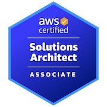

<h1 align="center">Hi 👋, I'm Shivam Ekale</h1>

<h3 align="center">DevOps Engineer | AWS Cloud Enthusiast | Docker | Kubernetes | CI/CD</h3>

  
 

---

## 👨‍💻 About Me

I am a **DevOps Engineer and AWS Cloud Enthusiast** focused on building secure, scalable, and automation-driven cloud infrastructure.  
My work is centered around **AWS, CI/CD, Linux, Docker, Kubernetes, monitoring, networking, and production-ready deployment workflows**.

- 🚀 Building real-world **DevOps and AWS cloud projects**
- ☁️ Hands-on with **VPC, EC2, ALB, Auto Scaling, RDS, S3, Lambda, API Gateway, DynamoDB, IAM, CloudFront, and CloudWatch**
- 🐳 Working with **Docker, Docker Hub, Kubernetes, Helm, Argo CD, and GitOps workflows**
- 🔁 Automating deployments using **Jenkins, GitHub Actions, Git, and GitHub webhooks**
- 🏗️ Learning and implementing **Terraform, AWS CloudFormation, and YAML-based infrastructure configuration**
- 📊 Focused on **automation, reliability, scalability, security, and clean documentation**

---

## 🛠️ Tech Stack

  

---

## ⚙️ Core Skills

<table>
  <tr>
    <td><b>☁️ Cloud Platforms</b></td>
    <td>AWS EC2, VPC, S3, IAM, Auto Scaling, Elastic Load Balancing, RDS, Aurora, Lambda, API Gateway, DynamoDB, CloudFront, CloudWatch, Route 53</td>
  </tr>
  <tr>
    <td><b>🔁 DevOps & CI/CD</b></td>
    <td>Jenkins, GitHub Actions, Git, GitHub, Webhooks, Pipeline Workflows, Deployment Automation</td>
  </tr>
  <tr>
    <td><b>🐳 Containers & Orchestration</b></td>
    <td>Docker, Docker Hub, Docker Swarm, Kubernetes, Minikube, kOps, Helm, Argo CD</td>
  </tr>
  <tr>
    <td><b>🏗️ Infrastructure as Code</b></td>
    <td>Terraform, AWS CloudFormation, YAML</td>
  </tr>
  <tr>
    <td><b>📊 Monitoring & Observability</b></td>
    <td>Prometheus, Grafana, AWS CloudWatch</td>
  </tr>
  <tr>
    <td><b>🐧 Operating Systems</b></td>
    <td>Amazon Linux 2023, Ubuntu</td>
  </tr>
  <tr>
    <td><b>🔧 Scripting</b></td>
    <td>Bash, Python</td>
  </tr>
  <tr>
    <td><b>🌐 Networking</b></td>
    <td>VPC, Subnets, Route Tables, Internet Gateway, NAT Gateway, Security Groups, Load Balancing, DNS</td>
  </tr>
</table>

---

## 🏆 Certification

<table>
  <tr>
    <td width="150" align="center">
      
    </td>
    <td>
      <h3>AWS Certified Solutions Architect – Associate</h3>
      

        Verified AWS certification demonstrating knowledge of designing
        <b>secure, scalable, highly available, and cost-optimized cloud architectures</b>
        using AWS services such as VPC, EC2, IAM, Load Balancing, Auto Scaling, RDS, and S3.
      

      

        <b>Issued:</b> 24 March 2026
      

      <a href="https://www.credly.com/badges/9bf512e8-f7bb-4f2e-af60-298a7f478cae/public_url" target="_blank">
        <b>🔗 View Verified Credential</b>
      </a>
    </td>
  </tr>
</table>

---

## 🚀 Featured Projects

### 1️⃣ AWS 3-Tier Application Deployment

Designed and deployed a secure and scalable **AWS 3-tier architecture** with separate web, application, and database layers across multiple Availability Zones.

**Highlights**

- Built a VPC-based architecture with public and private subnets
- Configured internet-facing and internal Application Load Balancers
- Deployed EC2-based web and application tiers with Auto Scaling
- Integrated Amazon RDS MySQL with private-only database access
- Applied security group rules for controlled traffic flow

🔗 **Repository:** [AWS Three-Tier Application Deployment Project](https://github.com/Its-Shiivam22/AWS-Three-Tier-Application-Deployment-Project)  
📘 **Documentation:** [View README](https://github.com/Its-Shiivam22/AWS-Three-Tier-Application-Deployment-Project/blob/main/README.md)

---

### 2️⃣ AWS Serverless Expense Tracker Application

Built a serverless expense tracking application using AWS managed services with secure authentication, API-driven backend logic, and user-specific expense records.

**Highlights**

- Hosted the frontend using Amazon S3 and CloudFront
- Implemented Cognito Hosted UI authentication with JWT authorization
- Created CRUD APIs using API Gateway and AWS Lambda
- Stored user-specific expense data in DynamoDB
- Reduced server management by using a fully serverless architecture

🔗 **Repository:** [AWS Serverless Expense Tracker Application](https://github.com/Its-Shiivam22/AWS-Serverless-Expense-Tracker-Application)  
📘 **Documentation:** [View README](https://github.com/Its-Shiivam22/AWS-Serverless-Expense-Tracker-Application/blob/main/README.md)

---

### 3️⃣ Banking Microservices Application on Kubernetes

Deployed a MySQL-connected banking microservices application on an AWS kOps Kubernetes cluster using CI/CD and GitOps-based deployment practices.

**Highlights**

- Built and pushed Docker images to Docker Hub
- Automated image updates using Jenkins and GitHub webhook triggers
- Used Argo CD for GitOps-based Kubernetes manifest synchronization
- Configured NGINX Ingress for routing application paths
- Implemented RBAC and HPA-based autoscaling for controlled and scalable workloads

🔗 **Repository:** [Banking Microservices App Kubernetes Deployment Project](https://github.com/Its-Shiivam22/Banking-Microservices-App-Kubernetes-Deployment-Project)  
📘 **Documentation:** [View README](https://github.com/Its-Shiivam22/Banking-Microservices-App-Kubernetes-Deployment-Project/blob/main/README.md)

---

## 📊 GitHub Analytics

  
  

---

## 🌐 Connect With Me

---

## ⚡ Mindset

  <b><i>“Automate everything. Scale anything. Learn continuously.”</i></b>

---

  ⭐ From <a href="https://github.com/Its-Shiivam22"><b>Its-Shiivam22</b></a>

